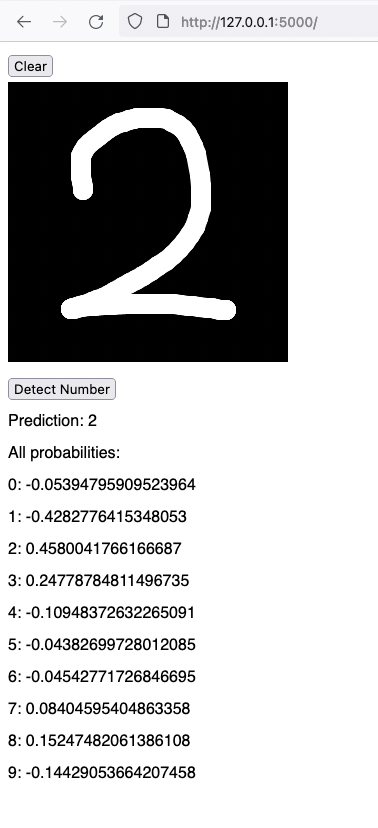

# zahl

Simple PyTorch model + Flask web service guessing a number from B/W drawing.

Based on Bes' [besarthoxhaj/mind](https://github.com/besarthoxhaj/mind) workshop
at [Founders and Coders](https://www.foundersandcoders.com/) Saturdays.



## ML Model

We make our model in a Jupyter Notebook, running inside Docker:

```sh
cd ml_model
docker-compose up --build
```

Open browser at: http://127.0.0.1:8888/lab?token=xxx

## Web server

We copy our latest (or best) model from the `ml_model` dir to the `server` dir:

```sh
cp ml_model/work/model.pth server/src/
```

We serve using Docker:

```sh
cd server
docker-compose up --build
```

Open browser at: http://127.0.0.1:5000/

## License

MIT
